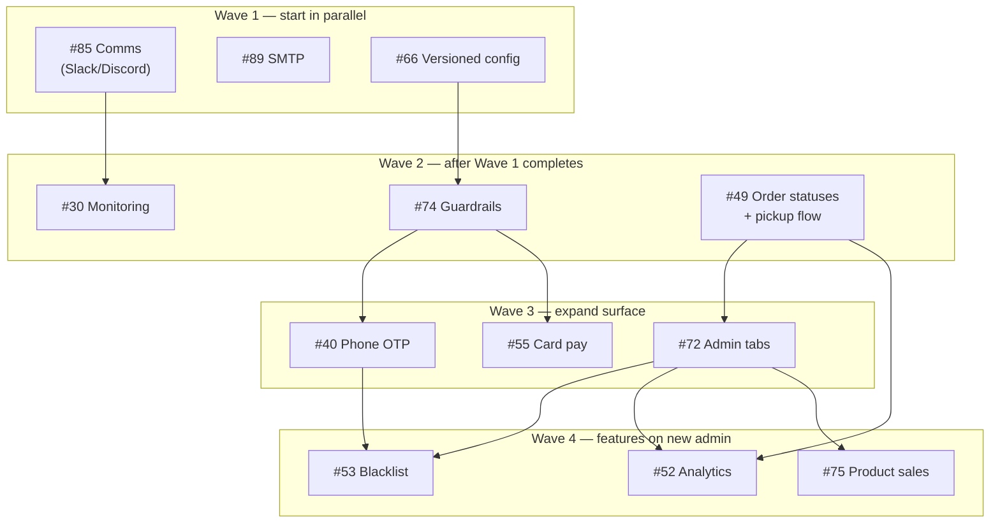

# GitHub issue execution order (Kalooda)

**Purpose:** Recommended order for open work, derived from **blocking** dependencies only (no cycles).  
**Last updated:** 2026-04-15

> **Agent maintenance:** Whenever a tracked issue is **completed** (closed as done, or explicitly verified shipped), update this file: adjust phases, mark items done, refresh the diagram, and bump **Last updated**.

---

## Shipped reference (do not schedule)

These are closed or no longer gate other work; kept for context when reading issue bodies.

- **#47** — RLS, storage, seed  
- **#26** — Admin RBAC / middleware  
- **#84** — GitHub org migration  
- **#57** — Unavailable-today storefront UX (chatbot #29 still references behavior)
- **#41** — Checkout delivery/pickup, address, cash on delivery; profile saved address
- **#28** — Customer `/account/orders` Realtime (status + delete sync), live modal status, shared status badge colors with admin (PR #103; optional admin “new order” toast/sound not in scope)
- **#51** — Delivery zones (PostGIS geofencing shipped in PR #130)

---

## Suggested execution order (by wave)

Read **top to bottom**; within a wave, items can run **in parallel** unless a row says *after …*.

| Wave        | Issues                             | What                                                                                                           |
| ----------- | ---------------------------------- | -------------------------------------------------------------------------------------------------------------- |
| **1**       | **#85**, **#89**, **#66**          | Comms foundation; SMTP; versioned multi-tenant config.                                                       |
| **2**       | **#30** *after #85*                | Error monitoring (alerts route into team channels).                                                            |
| **2**       | **#74** *after #66*                | Platform guardrails / per-business limits.                                                                     |
| **2**       | **#49**                            | Order statuses + pickup flow.                                                                                  |
| **3**       | **#72** *after #49*                | Admin redesign (tabs, search).                                                                                 |
| **3**       | **#40** *after #74*                | Phone OTP (uses rate limits from #74).                                                                         |
| **3**       | **#55** *after #74*                | Card payments.                                                                                                 |
| **4**       | **#53** *after #40 + #72*          | Customer blacklist (Customers tab + verified phones).                                                          |
| **4**       | **#52** *after #49 + #72*          | Admin analytics.                                                                                               |
| **4**       | **#75** *after #72*                | Product sales / strikethrough pricing (also needs DB work; see issue).                                         |
| **Ongoing** | **#27**, **#83**, **#29**          | Validation epic, API caps, chatbot improvements — coordinate with CI (#67).                                    |
| **Ongoing** | **#67**                            | CI/CD — depends on **#27**, **#47✓**, **#84✓**, **#85**, **#30** per issue body; expand as validation hardens. |

---

## Diagram (waves = time flows downward)

Each box is an issue; arrows are **blocking** (must finish before the head of the arrow).  
**Parallel tracks** are side-by-side in the same wave.

**Critical paths** (longest chains to key outcomes):

- **Trusted phones + blacklist:** `#66 → #74 → #40 → #53`  
- **Admin insights:** `#49 → #72 → #52`  
- **Production email + OTP scale:** `#89` with `#74` + `#40`; **#85 → #30** for alert routing

---

## How this file stays accurate

1. Use **GitHub blocking deps** in issue bodies (`## Dependencies (blocking)`) as source of truth for edges.
2. On **issue close**, remove or strike through rows here, add to **Shipped reference**, and simplify the diagram.
3. On **new issues**, add them to the table + diagram only after **blocking** links are agreed.

