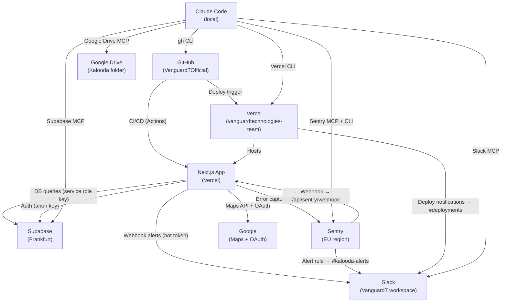

# Integrations & Secrets

Source of truth for every external service, credential, and token used in this project.
Update this file whenever a new integration is added or a credential changes.

**Last updated:** 2026-04-21

---

## Architecture Diagram

---

## Services

### Supabase

| Field | Value |
|---|---|
| Project | `mxbnmoagdufitnwrmsrn` (Frankfurt / eu-central-1) |
| Dashboard | https://supabase.com/dashboard/project/mxbnmoagdufitnwrmsrn |
| Region | Frankfurt — same region as Vercel for low latency |

**Credentials:**

| Var | Where used | Environments | Rotate at |
|---|---|---|---|
| `NEXT_PUBLIC_SUPABASE_URL` | Client + server | All | Never (stable) |
| `NEXT_PUBLIC_SUPABASE_ANON_KEY` | Client (RLS enforced) | All | If compromised |
| `SUPABASE_SERVICE_ROLE_KEY` | Server-side API routes only — never client | Prod + Preview | If compromised |

**Rotation:** Supabase dashboard → Project Settings → API → Regenerate. Update Vercel env vars → redeploy.

---

### Sentry

| Field | Value |
|---|---|
| Org | `vanguardt` |
| Project | `javascript-nextjs` |
| Region | EU (de.sentry.io) |
| Dashboard | https://vanguardt.sentry.io |
| Plan | Free (14-day Business trial active as of 2026-04-14) |

**Credentials:**

| Var | Purpose | Stored in | Environments |
|---|---|---|---|
| `NEXT_PUBLIC_SENTRY_DSN` | Client-side error capture | Vercel env | Prod + Preview |
| `SENTRY_DSN` | Server-side error capture | Vercel env | Production |
| `SENTRY_AUTH_TOKEN` | Source map uploads at build time | Vercel env | Prod + Preview |
| `SENTRY_ORG` | `vanguardt` | Vercel env | Prod + Preview |
| `SENTRY_PROJECT` | `javascript-nextjs` | Vercel env | Prod + Preview |

**Local tools:**
- Sentry CLI: authenticated at `~/.sentry/cli.db` — token expires **2026-05-15**
- Sentry MCP: configured in `~/.claude.json` via OAuth, scoped to `vanguardt/javascript-nextjs`

**Alert rules:**
- "Production Errors" — new issue → Slack `#kalooda-alerts` + webhook `/api/sentry/webhook`

**Rotation:** sentry.io → Settings → Auth Tokens → revoke + create new. Update `SENTRY_AUTH_TOKEN` in Vercel.

---

### Slack

| Field | Value |
|---|---|
| Workspace | `VanguardT` (vanguardt.slack.com) |
| Team ID | `T0ASJGX1SCV` |
| App | `VanguardT Bot` (bot ID: `B0AT0SB1KT3`) |

**Channels:**

| Channel | ID | Purpose |
|---|---|---|
| `#dev` | `C0ASRGYRT8C` | Code discussion, PR reviews |
| `#deployments` | `C0AS6FV6BRD` | Vercel deploy notifications |
| `#kalooda-alerts` | `C0ASJHCE9AR` | Sentry errors + audit results |
| `#all-vanguardt` | `C0ASRGRAB52` | Company-wide announcements |

**Credentials:**

| Var | Purpose | Stored in |
|---|---|---|
| `SLACK_BOT_TOKEN` (`xoxb-...`) | Post messages to channels | Vercel env (production) + `~/.claude.json` |

**Integrations connected:**
- Vercel → `#deployments` (subscribed to: deployment_ready, deployment_promoted, deployment_error)
- Sentry → `#kalooda-alerts` (via native Slack integration — Team plan required for full features)

**Rotation:** Slack app settings → OAuth tokens → regenerate. Update Vercel env + `~/.claude.json`.

---

### Vercel

| Field | Value |
|---|---|
| Team | `vanguardtechnologies-team` |
| Project | `kalooda` (ID: `prj_N88VwfTGNCrM651l76kuzKmA8Bht`) |
| Org ID | `team_nx5E8Fk9GPUBpcK2CyWhrFPB` |
| Production domain | `www.kaloodasweets.com` |
| Plan | Hobby (free) |

**Credentials:**

| Token | Purpose | Stored in | Expires |
|---|---|---|---|
| `vcp_2DBV...` (Vercel CLI token) | CLI + API access | Used in terminal sessions | Check Vercel dashboard |

**Limitations on free plan:**
- No private org repos (must stay public)
- No log drains (Axiom etc. blocked)
- Runtime logs retained for 1 hour only

**Rotation:** Vercel dashboard → Account Settings → Tokens → delete + create new.

---

### Google

**Maps API:**

| Field | Value |
|---|---|
| Var | `NEXT_PUBLIC_GOOGLE_MAPS_API_KEY` |
| Stored in | Vercel env (all environments) |
| Restrictions | `http://127.0.0.1:3000/*`, `http://localhost:3000/*`, `https://*.vercel.app/*`, `https://kaloodasweets.com/*`, `https://www.kaloodasweets.com/*` |

**OAuth (Sign in with Google):**
- Configured under VanguardT Google account
- Client ID/Secret managed in Google Cloud Console
- Supabase handles the OAuth flow server-side

**Rotation:** Google Cloud Console → APIs & Services → Credentials → regenerate key. Update Vercel env.

---

### GitHub

| Field | Value |
|---|---|
| Org | `VanguardTOfficial` |
| Repo | `VanguardTOfficial/Kalooda` |
| Visibility | Public |
| Plan | Free |

**Members (both Owner role):**
- `AbedAwaisy`
- `moamenSaleh-ghub`

**Security features enabled:**
- Secret scanning ✓
- Push protection ✓
- Branch protection on `main`: CI must pass + 1 reviewer approval

**GitHub Actions secrets set:**
- `SLACK_BOT_TOKEN` — weekly audit posts to `#kalooda-alerts`

**Note:** Toggling repo visibility (public↔private) has been observed to silently drop branch protection reviewer requirement. Verify after any visibility change.

---

### Google Drive (Claude Code MCP)

| Field | Value |
|---|---|
| Kalooda Project folder ID | `1iTxRbSysblrslKFWzozPCGVUleCw7bmN` |
| Credentials | `~/gdrive-mcp/credentials.json` + `~/gdrive-mcp/token.json` |
| Must remain | Publicly shared (for image fetch workaround) |

---

## Local Tool Config (`~/.claude.json`)

| MCP Server | Purpose | Key config |
|---|---|---|
| `gdrive` | Google Drive access | Credentials at `~/gdrive-mcp/` |
| `slack` | Post/read Slack messages | `SLACK_BOT_TOKEN`, team `T0ASJGX1SCV` |
| `sentry` | Query/triage Sentry issues | HTTP MCP at `https://mcp.sentry.dev/mcp/vanguardt/javascript-nextjs` |
| `supabase` | DB operations | Via Supabase MCP server |

---

## Pending / Not yet implemented

| Integration | Status | Issue |
|---|---|---|
| SMS provider (TextMe) | Awaiting response to Hebrew inquiry | — |
| Payment provider | Research done (PayMe/Stripe Connect) | #55 |
| Persistent error logs | Design needed | #151 |
| Claude bot in Slack (interactive) | Needs HTTP endpoint + Anthropic API key | #125 |

---

## Rotation Checklist

When rotating any credential:
1. Generate new credential in the provider's dashboard
2. Update Vercel env var (Production + Preview as needed)
3. Update `~/.claude.json` or local tool config if applicable
4. Redeploy to Vercel (push empty commit or trigger manually)
5. Update this file with new rotation date
6. Revoke the old credential
